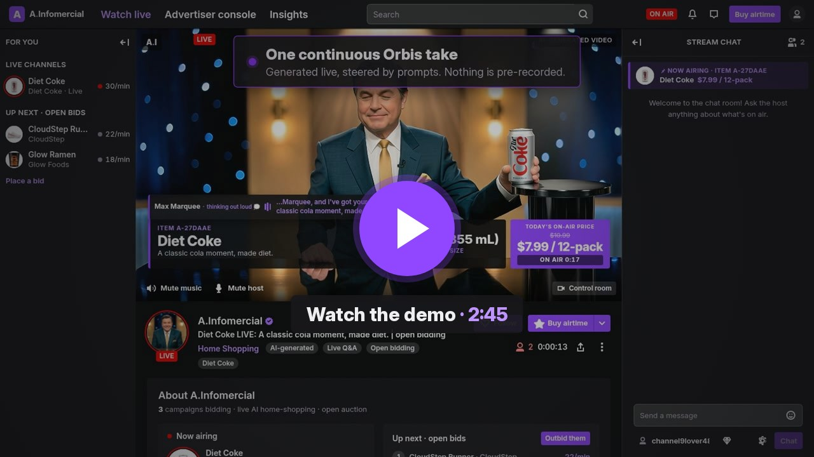
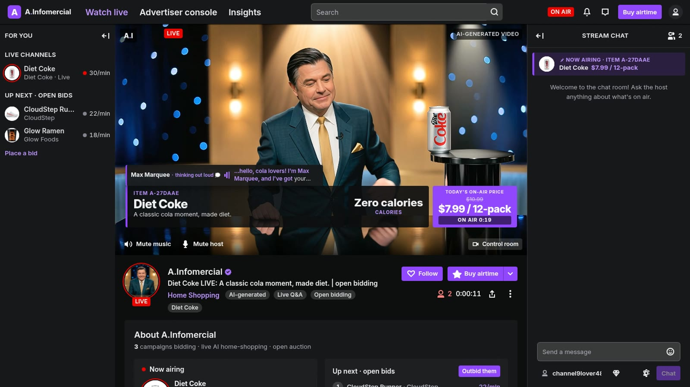
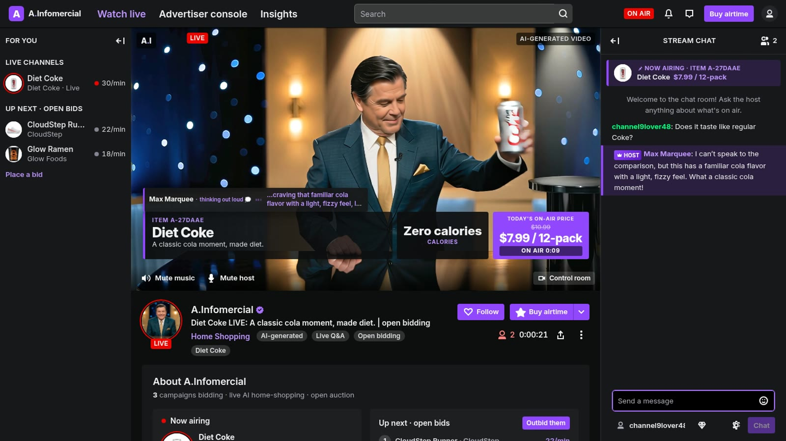
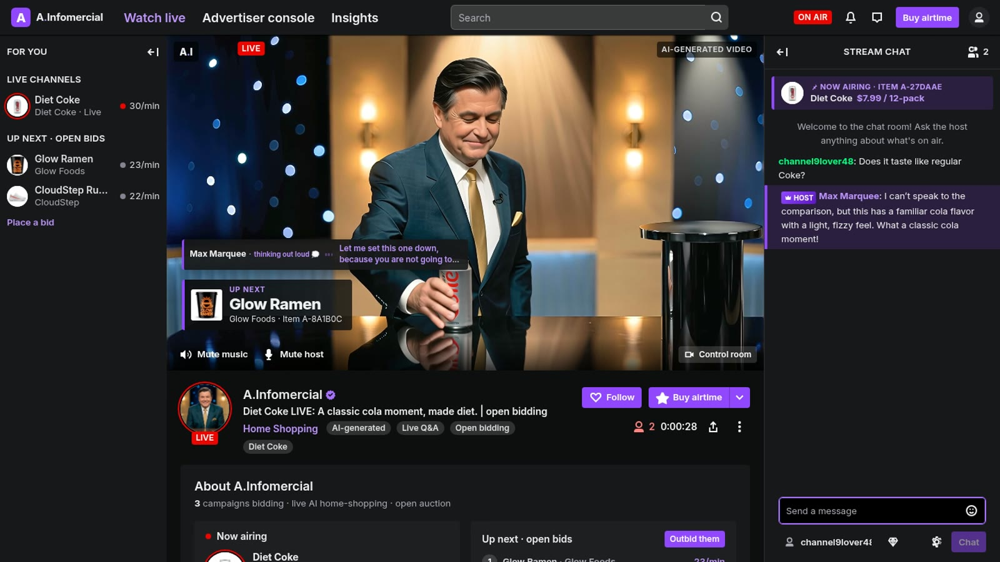
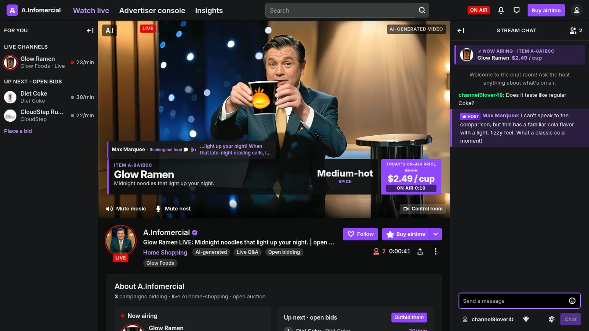
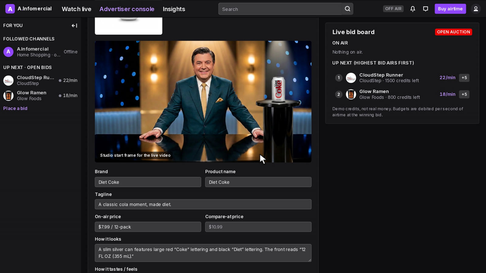
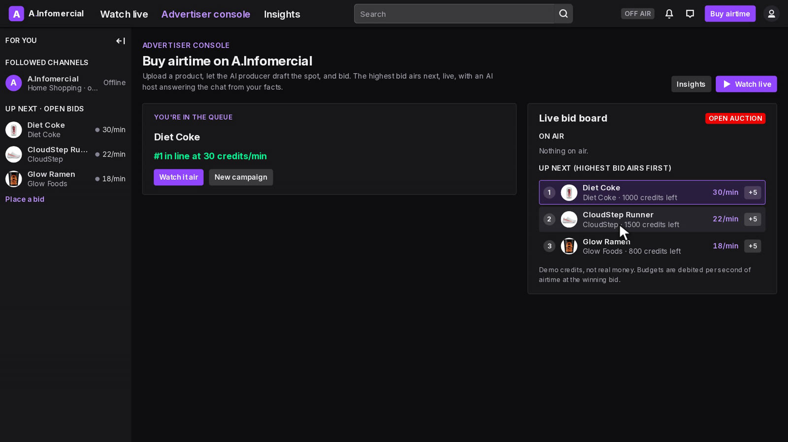
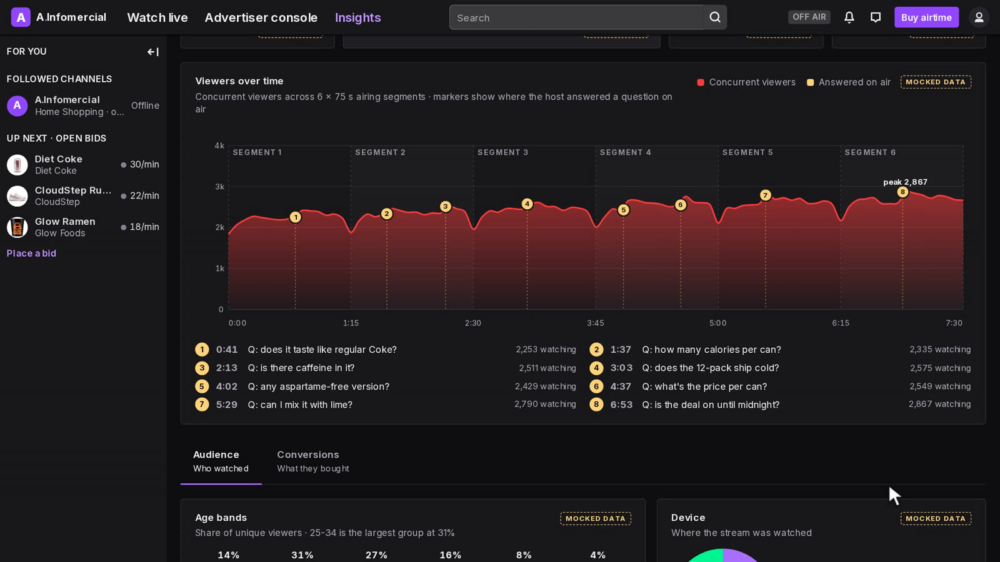

# A.Infomercial

**The shopping channel anyone can buy airtime on.** A live, AI-generated home-shopping TV
channel with open bidding. Advertisers upload a product and bid for airtime. The highest bid
airs next, and [Reactor Orbis](https://docs.reactor.inc) generates the infomercial in real
time. Viewers ask questions in a Twitch-style chat, and the host answers on air from the
advertiser's facts while the video re-stages to show the answer.

Built for the [Visko Orbis Online Challenge](https://www.visko.ai/challenge/orbis-september-2026)
(September 2026).

Live: https://5whyuw3k.insforge.site · `/live` (the channel) · `/console` (advertisers) ·
`/console/insights` (mocked analytics) · **[`/demo`](https://5whyuw3k.insforge.site/demo) (2:45 demo video)**

## Demo video

[](https://www.youtube.com/watch?v=jA58-AasDsA)

**[Watch on YouTube](https://www.youtube.com/watch?v=jA58-AasDsA)** (2:45, 1080p) · also on the site at
[`/demo`](https://5whyuw3k.insforge.site/demo) with chapters: what it is → advertiser console → the live
channel (on-air Q&A, a +5 raise, steered handoffs in one continuous Orbis take) → insights.

## Screenshots

| | |
| - | - |
|  |  |
| **On air.** One continuous Orbis take; every graphic is HTML from the campaign. | **Live Q&A.** The answer is spoken by Max and grounded in the advertiser's facts. |
|  |  |
| **Steered handoff.** "The host lowers the Diet Coke down behind the counter…", then the next product is lifted into the same take. | **Open bidding.** A +5 raise put Glow Ramen next; the graphics switch once it is in his hands. |
|  |  |
| **AI draft.** Upload a photo; the producer drafts copy, facts, scene beats and the start frame. | **Bid board.** The highest bid airs next. |
|  | |
| **Insights.** Audience and conversions, mocked for the demo and labelled that way. | |

## Why it needs a live model

A pre-rendered ad can't answer a question it has never heard. Here the picture is a live
Orbis session that never repeats:

- **One continuous take.** The broadcast opens on the first product's staged studio shot
  (`set_image` → `set_prompt` → `start`) and then never cuts: every 30 s the host, Max Marquee,
  lowers the product out of view and lifts the next one into the same shot, steered purely by
  `set_prompt` (one physical action per prompt, per the Orbis prompt guide).
- **Every viewer question changes the shot.** "Does it taste like regular Coke?" gets a
  spoken, fact-grounded answer and a new scene prompt (a pour over ice), which lands 2-4 s
  later on everyone's screen.
- **The queue is an open auction.** Raising a bid re-orders "Up next" live. Budgets are
  debited per second of airtime at the winning bid.

## How it works

| Piece | What it does |
| - | - |
| `/console` | Upload a photo → **AI draft** (vision model reads the pack: tagline, look, taste, facts, 5 scene beats, host script; an image model places the product on the pedestal of the shared studio plate) → edit → bid → submit. Live bid board with +5 raises. |
| `/live` | Twitch-style channel page around one shared Orbis session. HTML overlays (item #, price box, fact card, on-air clock, "AI-generated" label, "Up next" bar) that switch when the product changes in the picture, realtime chat, viewer count, bid rail. |
| Sound | Orbis audio is switched off (`set_audio_enabled false`): with a host in frame it invented garbled speech. Max performs silently, lips closed, like a silent-film showman; his voice is cached Gemini TTS ("thinking out loud", with captions), over a lounge loop synthesized in the browser with Web Audio that ducks under his voice. |
| Director | The first viewer's tab holds a 15 s lease and runs the airing loop: pick the top bid, stage it, walk its beats, cue answer shots, bill airtime. If that tab closes, another viewer's tab takes over the same session. |
| Handoff | Steered, not stitched (`lib/handoff.ts`): 8 s before a 30 s segment ends the director prompts "The host lowers the X down behind the counter, out of view." (every tab's host voice says the handoff line and the graphics drop to an "Up next" bar), 3.5 s later "rests both empty hands on the counter", and the next segment opens with "The host lifts the Y, *its look*, up from behind the counter…", with its graphics sliding in once the lift has landed. The run is only restarted from a start frame near Orbis's ~61 min limit (behind a freeze-frame crossfade; harness `/lab/handoff`). |
| Host | `lib/server/host-answer.ts`: picks the best fresh viewer question, answers in ≤ 30 words from the campaign facts only (deflects off-topic, medical and prompt-injection questions), chooses the fact to highlight, and writes the Orbis re-stage prompt. p50 1.8 s. |
| Session | Created server-side (`POST /sessions`), so no browser tab owns it. Tabs attach with bound tokens that cannot create sessions. A reaper ends it 60 s after the last director heartbeat. |
| Backend | [InsForge](https://insforge.dev): Postgres (campaigns, chat, channel state, RLS: public read, server-only writes), Storage (product images), Realtime (`station:main` events, `station:viewers` presence), Sites (Vercel hosting), Model Gateway (OpenRouter). |

Truthful-ads rule: prices, facts and product names are always HTML text from the advertiser's
campaign. The generated video is staging and mood only, and every frame is labelled AI-generated.

## Run it

```bash
cp .env.example .env.local   # REACTOR_API_KEY, NEXT_PUBLIC_INSFORGE_URL, NEXT_PUBLIC_INSFORGE_ANON_KEY,
                             # INSFORGE_API_KEY, OPENROUTER_API_KEY, REAPER_SECRET
npm install
npx -y @insforge/cli db migrations up --all
node --env-file=.env.local scripts/seed-demo.mjs          # Diet Coke demo campaign
node --env-file=.env.local scripts/seed-competitors.mjs   # two fictional rivals
npm run dev
```

Open `/live` and click **Tune in** (WebRTC; needs a network that allows UDP or TURN).
`/lab` keeps the original Orbis starter playground (dev only).

Built on the [Orbis hackathon starter](https://github.com/Visko-Platform/orbis-online-hackathon-starter).
